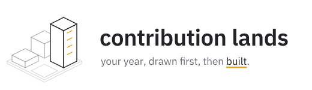
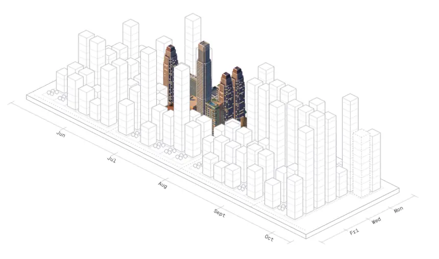
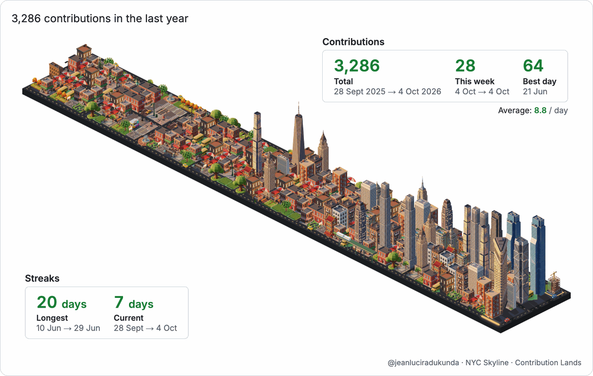

<p align="center">
  <picture>
    <source media="(prefers-color-scheme: dark)" srcset="docs/logo-dark.svg">
    
  </picture>
</p>

<p align="center">
  
  <a href="https://chromewebstore.google.com/detail/contribution-lands/bbapichgjbdkehhdgaonahkjicihdhih"></a>
  
  
</p>

<p align="center">
  <a href="https://jeanluciradukunda.github.io/contribution-lands/"></a>
</p>

> Turns the contribution graph on GitHub profile pages into an isometric New York skyline, with streaks, stats and landmarks.

## What is Contribution Lands?

A browser extension that rebuilds GitHub's contribution calendar as a small isometric New York. Every day of the year is a lot in the city: quiet days stay as empty lots or weekend parks, busier days become taller buildings, and your best days are marked with landmark towers. Streets run between the blocks with taxis in them, your longest streak becomes an elevated railway, and today's lot is a construction site that grows as you contribute.

A stats panel shows your total, best day, daily average and streaks. Hover a building to see its day, or click it to filter GitHub's activity feed to that day. It works with GitHub's light and dark modes, and the toolbar popup switches between the flat graph, the land or both.

NYC is the only world in the extension for now. The repository also holds earlier sprite sets (Paris, Cape Town, a rainforest) used by the README card and theme experiments.

## Project Structure

```
contribution-lands/
├── extension/                  # Chrome extension (Manifest V3)
│   ├── src/                    # Content script, renderer, popup
│   └── dev/                    # Local harness: npm run harness
├── themes/                     # Ready-to-use sprite assets (committed)
│   ├── theme.schema.json       # What a valid theme looks like
│   ├── city-nyc/
│   │   ├── theme.json          # Theme metadata, entity config, colors
│   │   └── sprites/            # Clean, transparent, correctly-sized PNGs
│   └── ...
├── tools/
│   └── theme-generator/        # Standalone sprite generation pipeline
│       ├── README.md            # How to create a new theme
│       ├── generate.py          # AI sprite generation via Gemini API
│       ├── prompts/             # Per-theme prompt templates
│       ├── processing/          # Background removal + resizing
│       ├── validation/          # Quality checks + HTML report
│       └── tests/               # pytest suite
└── docs/
    └── creating-themes.md       # Complete prompt writing guide
```

## Install

Install it from the [Chrome Web Store](https://chromewebstore.google.com/detail/contribution-lands/bbapichgjbdkehhdgaonahkjicihdhih).

Or build it yourself:

```bash
git clone https://github.com/jeanluciradukunda/contribution-lands.git
cd contribution-lands/extension
pnpm install && pnpm build   # then load extension/dist
```

Then visit any GitHub profile: the contribution graph becomes a city. Requires Chrome 111 or later. See the [privacy policy](https://jeanluciradukunda.github.io/contribution-lands/privacy.html).

### Put your land in your profile README

Add this workflow to your profile repository (the one named after your username). It renders your city every night and commits the images.

```yaml
# .github/workflows/contribution-land.yml
name: Contribution land
on:
  schedule:
    - cron: "0 3 * * *"
  workflow_dispatch:
permissions:
  contents: write
jobs:
  render:
    runs-on: ubuntu-latest
    steps:
      - uses: actions/checkout@v4
      - uses: jeanluciradukunda/contribution-lands@main
        with:
          theme: city-nyc
          output-dir: images
      - run: |
          git config user.name "github-actions[bot]"
          git config user.email "41898282+github-actions[bot]@users.noreply.github.com"
          git add images
          git commit -m "Update contribution land" || exit 0
          git push
```

Then show it in your `README.md`, matching the reader's light or dark mode:

```html
<picture>
  <source media="(prefers-color-scheme: dark)" srcset="images/contribution-land-dark.webp">
  
</picture>
```



### Try it locally

```bash
cd extension
npm run harness   # http://localhost:5199/dev/harness.html
```

The harness renders the content script against a saved contribution calendar with GitHub's own stylesheets, in light or dark mode and at several widths.

### Generate Sprites (for contributors)

See [tools/theme-generator/README.md](tools/theme-generator/README.md) for the full guide.

```bash
cd tools/theme-generator
python3 -m venv .venv && source .venv/bin/activate
pip install -r requirements.txt
export GOOGLE_API_KEY="your-key"  # Free at aistudio.google.com/apikey

python generate.py --list               # See available themes
python generate.py city-nyc             # Generate one theme
python -m validation.validate_all       # Validate + HTML report
```

## Inspiration

- [isometric-contributions](https://github.com/jasonlong/isometric-contributions): the original isometric GitHub extension. Some code is adapted from it under the MIT licence; see [THIRD_PARTY_NOTICES.md](THIRD_PARTY_NOTICES.md).
- [isometric-nyc](https://cannoneyed.com/projects/isometric-nyc): AI-generated isometric pixel art of NYC.

## Contributing

See [CONTRIBUTING.md](CONTRIBUTING.md). To create a new theme, follow [tools/theme-generator/README.md](tools/theme-generator/README.md).

## License

[MIT](LICENSE), Jean Luc Iradukunda. Building names are used descriptively. Not affiliated with or endorsed by GitHub, Inc.
